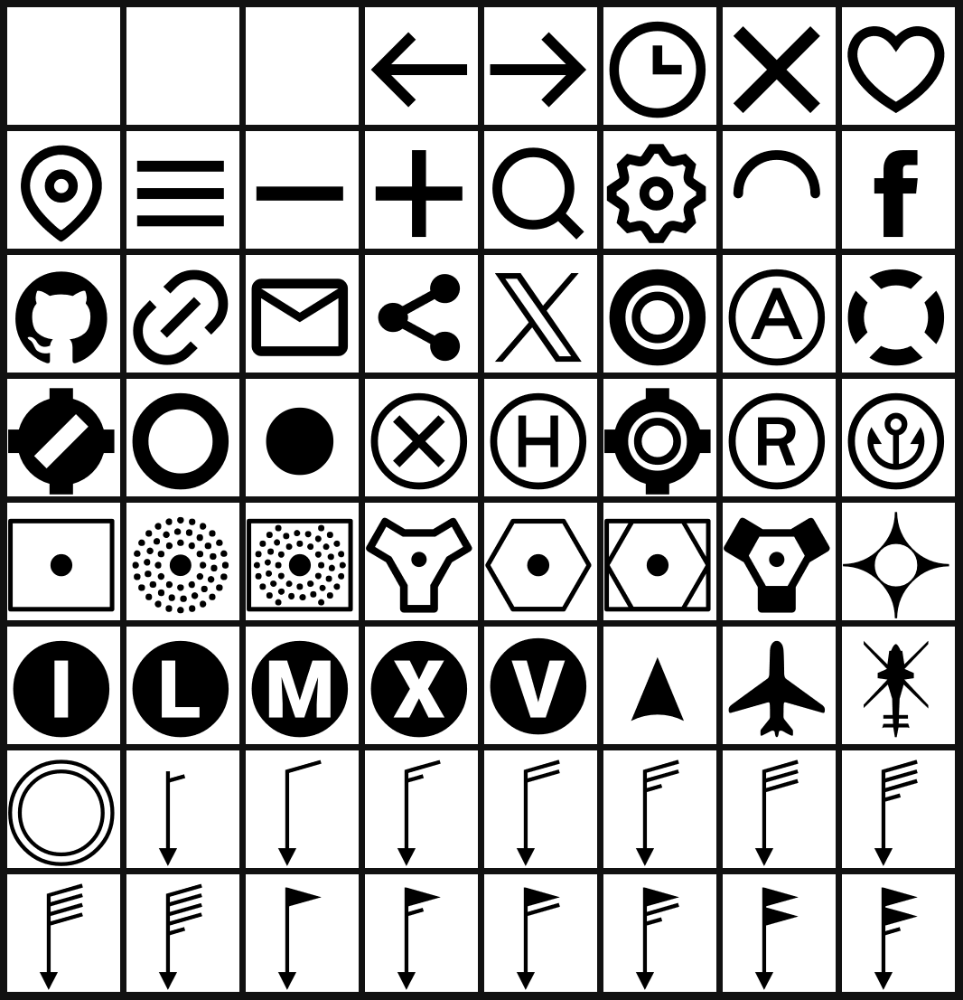

# AvioType

**The official Airportmap icon typeface.**

AvioType is a custom icon font developed for use within the Airportmap ecosystem. It provides aviation-specific symbols such as airport categories, navaids, markers, and other navigation-related icons in a unified typographic format.

_This is an early pre-alpha version and subject to further expansion._

## Glyphs



## Formats

The font is provided in the following web-compatible formats:

- `AvioType-Regular.eot`
- `AvioType-Regular.otf`
- `AvioType-Regular.svg`
- `AvioType-Regular.ttf`
- `AvioType-Regular.woff`
- `AvioType-Regular.woff2`

Use in web environments is possible via direct embedding or CSS `@font-face` declarations. All glyphs are aligned to a 24×24 pixel grid for consistent rendering in UI elements and maps.

## Usage

The font is installed and used based on proven CSS standards:

```css
@font-face {
  font-family: 'AvioType';
  src: url( dist/AvioType-Regular.eot );
  src: url( dist/AvioType-Regular.eot?#iefix ) format( 'embedded-opentype' ),
  url( dist/AvioType-Regular.woff2 ) format( 'woff2' ),
  url( dist/AvioType-Regular.woff ) format( 'woff' ),
  url( dist/AvioType-Regular.ttf ) format( 'truetype' ),
  url( dist/AvioType-Regular.otf ) format( 'opentype' ),
  url( dist/AvioType-Regular.svg#uxfonteditor ) format( 'svg' );
}

.icon {
  speak: none;
  line-height: 1;
  text-rendering: optimizeLegibility;
  text-transform: none;
  font-family: 'AvioType' !important;
  font-weight: 400;
  font-style: normal;
  font-variant: normal;
  font-feature-settings: 'kern';
  font-variant-ligatures: common-ligatures;
  font-kerning: normal;
  -webkit-font-smoothing: antialiased;
  -moz-osx-font-smoothing: grayscale;
}
```

Use AvioType icons via:

```html
<i class="icon icon-civil-large"></i>
```

A live preview of all icons is available at [GitHub pages](https://airportmap.github.io/aviotype).

---

**© MIT License – 2025 Paul Köhler ([komed3](https://github.com/komed3))**